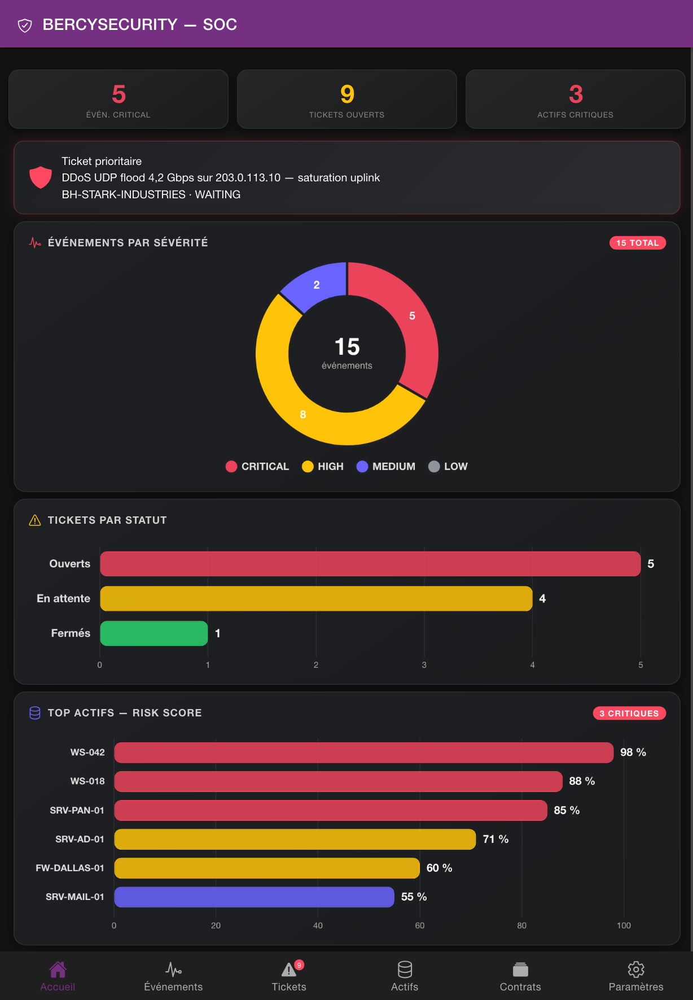

# Bercy


An open-source mobile SOC (Security Operations Center) dashboard built with Ionic + Angular.

Runs in the browser and as native iOS/Android apps via Capacitor.

> Internal joke: **Bercy would say “Cyber au verlant.”** 😄

## Table of contents

- [Why Bercy](#why-bercy)
- [Core features](#core-features)
- [Tech stack](#tech-stack)
- [Quick start](#quick-start)
- [Available scripts](#available-scripts)
- [Architecture notes](#architecture-notes)
- [Project structure](#project-structure)
- [Internationalization (i18n)](#internationalization-i18n)
- [Contributing](#contributing)
- [Security](#security)
- [Roadmap](#roadmap)
- [License](#license)

## Why Bercy

Bercy helps MSSPs and security teams monitor SIEM activity on the go:

- Track security events and ticket status quickly
- Visualize SOC KPIs from mobile devices
- Review assets, risk posture, and contract context in one app

## Core features

- **Dashboard**: KPI cards + three charts (severity breakdown, tickets by status, top risky assets)
- **Events**: filterable SIEM feed (ALL / CRITICAL / HIGH), MITRE ATT&CK context, raw event toggle
- **Issues**: status/priority ticketing with detail view and comments
- **Assets**: inventory with risk score, CVEs, criticality, and operational metadata
- **Contracts**: customer contracts with validity windows
- **Settings**:
  - Interface: dark/light, font size, compact mode, language (FR/EN), default tab
  - Security: session timeout, MFA, biometric lock, incognito mode, TLS pinning, notifications

Settings are persisted in `localStorage`.



## Tech stack

| Layer          | Choice                                 |
| -------------- | -------------------------------------- |
| Frontend       | Angular 19 + Ionic 8                   |
| Mobile runtime | Capacitor 7 (iOS/Android)              |
| Charts         | Chart.js 4 + chartjs-plugin-datalabels |
| Data           | Static JSON fixtures (current mode)    |
| API contract   | OpenAPI 3 (`openapi-bercy.yaml`)       |
| Mock backend   | json-server (`server/`)                |
| Testing        | Karma + Jasmine                        |

## Quick start

### Prerequisites

- Node.js 18+
- npm 9+
- Angular CLI 19
- Ionic CLI

### Install

```bash
git clone https://github.com/your-org/bercy.git
cd bercy
npm install
```

### Run locally

```bash
# Terminal 1: mock API server
npm run server

# Terminal 2: Angular dev server
npm start
```

App URL: <http://localhost:4200>

### Run on mobile (Capacitor)

```bash
npm run build
npx cap sync
npx cap open ios
# or
npx cap open android
```

## Available scripts

| Command          | Description                                   |
| ---------------- | --------------------------------------------- |
| `npm start`      | Start Angular dev server                      |
| `npm run build`  | Build production assets into `www/`           |
| `npm test`       | Run unit tests (Karma/Jasmine)                |
| `npm run lint`   | Run lint checks                               |
| `npm run e2e`    | Run end-to-end tests                          |
| `npm run server` | Start local json-server mock API on port 3000 |

## Architecture notes

- Current domain data is loaded from static files in `src/app/data/*.json`.
- Services such as `IssueService`, `ContractService`, `AssetService`, and `EventService` keep in-memory collections.
- OpenAPI-generated clients in `src/app/api/` exist but are not the active data path yet.
- The application shell is centered on `TabsPage` with routes under `/tabs/*`.

## Project structure

```text
src/
  app/
    tabs/             # tabs shell and tab routing
    pages/            # feature pages (home, events, issues, assets, contracts, settings...)
    shared/
      services/       # domain and app-level services
      components/     # reusable UI components
      directives/     # custom directives
      pipes/          # custom pipes
    data/             # static JSON fixtures
    model/            # OpenAPI-generated TypeScript models
    api/              # OpenAPI-generated API services
server/               # json-server configuration and dataset
android/              # Capacitor Android project
ios/                  # Capacitor iOS project
```

## Internationalization (i18n)

- Supported languages: French (`fr`) and English (`en`)
- Translation dictionaries and typed keys are in `src/app/shared/services/i18n.service.ts`
- Language is controlled by the settings state

## Contributing

Contributions are welcome.

1. Fork the repository
2. Create a feature branch (`feat/my-change`)
3. Keep changes focused and documented
4. Run quality checks before opening a PR:
   - `npm test`
   - `npm run lint`
5. Open a Pull Request with:
   - Clear summary
   - Screenshots/GIFs for UI changes
   - Linked issue (if any)

### Commit message guidance

Prefer Conventional Commits when possible:

- `feat: add risk trend widget`
- `fix: correct issue status filter`
- `docs: update setup instructions`

## Security

- Do not commit secrets, keys, or production credentials
- Use mock/local data for development
- If you discover a vulnerability, please report it privately to the maintainers instead of opening a public issue

## Roadmap

- [ ] Wire OpenAPI clients to a real backend
- [ ] Add CI pipeline for lint/test/build checks
- [ ] Improve test coverage for critical services
- [ ] Add accessibility and performance audits

## License

MIT
